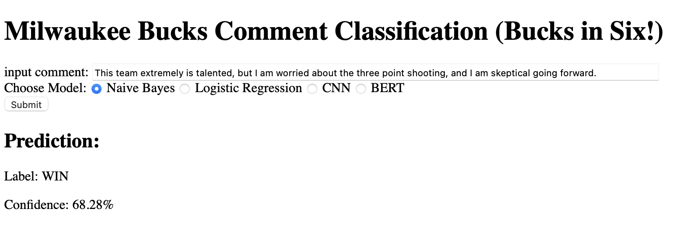
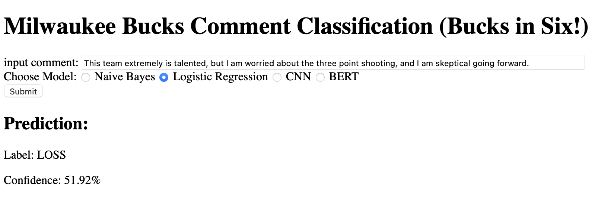
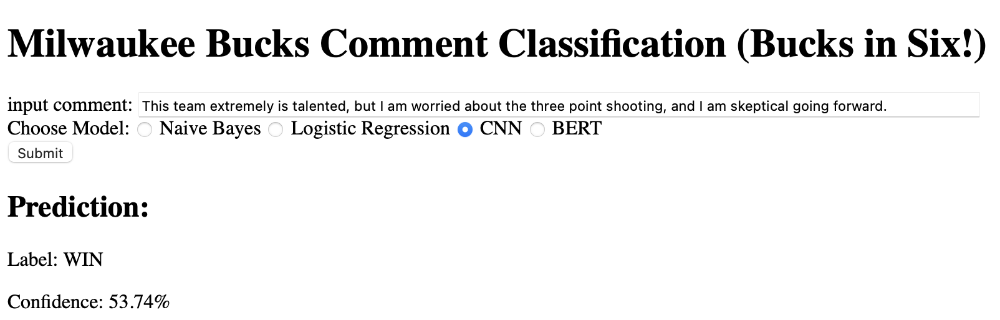
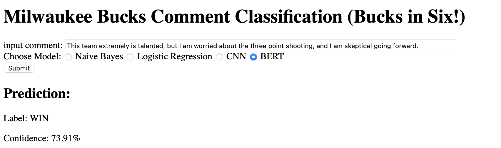

# Milwaukee Bucks Text Classification Project

The goal of this project was to evaluate the performances of different machine learning models on a text classification task. The task was to predict whether a comment in the subreddit r/MkeBucks's postgame thread followed a win or a loss. Classifying social media content can be difficult due to the use of informal language, lack of context, and ambiguity, and in this specific domain, there was concern that these problems might be exacerbated in a space of passionate fans. Thus, there are questions as to which methods best handle such difficulties, and so the project will consist of implementing and evaluating different text classification methods on the Reddit comments mentioned above, and the respective performances of the different methods might be of use to others searching to perform text classification on domain-specific social media content. 

Four different models were build and evaluated on this task:

- Bernoulli Naive Bayes
- Logistic Regression
- Convolutional Neural Network
- MiniBERT

These models were evaluated according to their F1 score.

### Bernoulli Naive Bayes

The Bernoulli Naive Bayes model was built using Python's scikit-learn library. The comments were tokenized using the CountVectorizer(), adhering to the Bag of Words model framework. For this model, the Reddit comments were stemmed, stopwords were removed, and non-alphanumeric characters were removed. A simple modification was made to the default settings of CountVectorizer() and Bernoulli Naive Bayes in scikit-learn by allowing the model to capture bi-grams, as while the goal was to keep the Naive Bayes model simple, accounting for bi-grams made the model more robust and able to capture more nuances within the data.

Below are some evaluation metrics for the model:

- Precision: 0.574
- Recall: 0.953
- F1: 0.717

### Logistic Regression

The Logistic Regression model was built using Python's scikit-learn library. The comments were tokenized using the CountVectorizer(), adhering to the Bag of Words model framework. For this model, the Reddit comments were stemmed, stopwords were removed, and non-alphanumeric characters were removed. A simple modification was made to the default settings of CountVectorizer() and Bernoulli Naive Bayes in scikit-learn by allowing the model to capture bi-grams, as while the goal was to keep the Naive Bayes model simple, accounting for bi-grams made the model more robust and able to capture more nuances within the data.

Below are some evaluation metrics for the model:

- Precision: 0.661
- Recall: 0.749
- F1: 0.703

### Convolutional Neural Network

The Convolutional Neural Network was constructed using tensorflow and Keras libraries. The model was designed in a function with customizable hyperparameters such as number of filters, kernel size, dense layer neurons, learning rate, and dropout rate. The model's architecture consists of an embedding layer that maps text to dense vectors, a convolutional layer for feature extraction, a max pooling layer to reduce dimensionality, a flattening step, and dense layers with L2 regularization targeted at binary classification through a sigmoid activation function. A major concern when designing this CNN was overfitting, and so an early stopping callback was implemented in the model. Then, a grid of the hyperparameters mentioned above was iterated over in order to determine the optimal model configuration. The hyperparameter tuning indicated that the best model had hyperparameters: filters = 48, kernel size = 4, number of dense layers = 40, learning rate = 0.001, and dropout rate = 0.6.

Below are some evaluation metrics for the model:

- Precision: 0.665
- Recall: 0.733
- F1: 0.698

### BERT Model

The pre-trained BERT model selected for this task was the MiniBERT model from Python's HuggingFace library. This model was chosen largely due to the limited computational resources available for this project, as MiniBERT is smaller and faster than other BERT models. 

The optimizer selected was Adam with a standard learning rate of `5e-5`. The training loop for this model consisted of a forward pass, in which a batch of size 30 was passed into the model, and a backward pass, in which the gradients were computed and model parameters updated according to the magnitude of the loss. 
Below are some evaluation metrics for the model:

- Precision: 0.674
- Recall: 0.633
- F1: 0.653
  
### Conclusions:

Although the Naive Bayes model had the highest F1 score, its relatively low precision score is cause for concern. Thus, it is difficult to generalize about the performances of these models on social media text classification tasks.

### Run the Demo:

In order to run the demo: follow these steps.

Install Virtual Environment:
```bash
pip install virtualenv
```
Create Folder:
```bash
virtualenv nlp-virtual
```
Activate Environment:
```bash
source nlp-virtual/bin/activate
```
Clone the repository:
```bash
git clone https://github.com/tulane-cmps6730/project-reddit.git
```
Go to repository folder and Install requirements:
```bash
cd folder
pip install -r requirements.txt
```

Install Code:
```bash
python setup.py develop
```
Activate Site:
```bash
nlp --web
```
If you open your web browser and go to ```http://127.0.0.1:6331```, you are ready to give the demo a try!

### Demo Screenshots

Below are screenshots of a Demo designed to predict whether a comment followed a win or a loss according to the selected model. Here are the predictions for the comment "This team is extremely talented, but I am worried about the three point shooting, and I am skeptical going forward."

Here are the predictions for each model on this comment:









